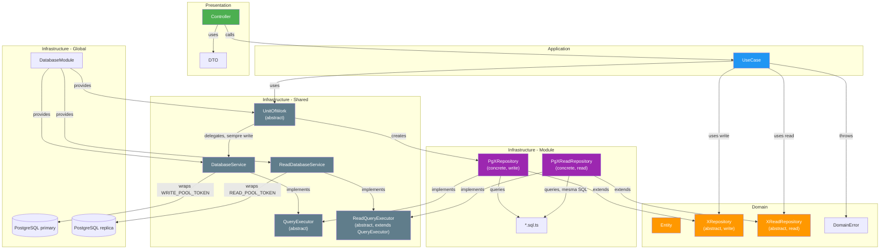

# Estrutura do Projeto: mybitcoin-api

## Objetivo

Definir uma estrutura de projeto que combine:

* **Clean Architecture**
* **DDD (Domain-Driven Design)**
* **NestJS**
* **PostgreSQL (pg puro)**

O objetivo é manter cada domínio autocontido, facilitar a evolução do sistema e reduzir o acoplamento entre módulos.

---

# Princípios

A organização do projeto segue quatro princípios fundamentais:

1. **Organização por domínio (Bounded Context)**
2. **Arquitetura Limpa dentro de cada domínio**
3. **Infraestrutura compartilhada apenas para recursos comuns**
4. **Cada módulo é dono da sua persistência**

Isso significa que o projeto **não é organizado por camadas globais** (`domain/`, `application/`, `infrastructure/` na raiz), mas sim por **módulos de negócio**, onde cada módulo possui suas próprias camadas.

---

# Estrutura Geral

```text
src/
│
├── infrastructure/
│   │
│   ├── database/
│   │   ├── database.module.ts
│   │   ├── database.service.ts
│   │   ├── database.token.ts
│   │   ├── query-executor.ts
│   │   ├── unit-of-work-postgres.service.ts
│   │   └── migrations/
│   │
│   ├── bitcoin-rpc/
│   │
│   ├── telemetry/
│   │
│   ├── storage/
│   │
│   ├── cache/
│   │
│   └── config/
│
├── modules/
│
│   ├── account/
│   │
│   ├── wallets/
│   │
│   ├── ledger/
│   │
│   ├── orders/
│   │
│   ├── trades/
│   │
│   ├── matching/
│   │
│   ├── bitcoin/
│   │
│   └── financial/
│
├── shared/
│   ├── domain.error.ts
│   └── unit-of-work.ts
│
└── app.module.ts
```

---

# Estrutura de um módulo

Cada módulo segue exatamente a mesma organização.

Exemplo:

```text
orders/
│
├── domain/
│
├── application/
│
├── infrastructure/
│
├── presentation/
│
└── orders.module.ts
```

Cada módulo é completamente independente dos demais.

---

# Domain

Contém apenas regras de negócio.

Nunca importa NestJS.

Nunca importa PostgreSQL.

Nunca importa bibliotecas externas.

Exemplo:

```text
orders/
└── domain
    ├── entities
    │   └── order.entity.ts
    │
    ├── value-objects
    │   ├── order-id.vo.ts
    │   └── price.vo.ts
    │
    ├── events
    │   └── order-created.event.ts
    │
    ├── errors
    │   └── insufficient-balance.error.ts
    │
    └── repositories
        └── order.repository.ts
```

A pasta `repositories` contém apenas interfaces.

Exemplo:

```typescript
export abstract class OrderRepository {

    abstract create(order: Order): Promise<void>;

    abstract findById(id: string): Promise<Order | null>;

}
```

---

# Application

Contém os casos de uso.

É responsável por orquestrar o domínio.

Não conhece SQL.

Não conhece PostgreSQL.

Não conhece NestJS.

Exemplo:

```text
orders/
└── application
    ├── place-order.usecase.ts
    ├── cancel-order.usecase.ts
    ├── fill-order.usecase.ts
    └── get-order.usecase.ts
```

Fluxo:

```
Controller

↓

UseCase

↓

Repository Interface
```

---

# Infrastructure

Implementa tudo que é detalhe técnico.

Aqui ficam:

* PostgreSQL
* SQL
* Mappers
* Integrações

Exemplo:

```text
orders/
└── infrastructure
    ├── persistence
    │
    │   ├── pg-order.repository.ts
    │
    │   ├── order.mapper.ts
    │
    │   └── order.sql.ts
    │
    └── events
```

---

## Repositories

As implementações pertencem ao módulo.

Exemplo:

```text
orders/
    infrastructure/
        persistence/
            pg-order.repository.ts
```

e **não**

```text
infrastructure/
    database/
        repositories/
```

Motivo:

`PgOrderRepository` implementa regras de persistência do domínio **Orders**, não da infraestrutura global.

---

## SQL

As queries SQL pertencem ao módulo.

Exemplo:

```text
orders/
    infrastructure/
        persistence/
            order.sql.ts
```

e não:

```text
infrastructure/
    database/
        queries/
```

Cada módulo é responsável pelas suas próprias consultas.

Isso facilita:

* manutenção
* versionamento
* otimização
* auditoria

---

# Presentation

Responsável apenas pela comunicação externa.

Exemplo:

```text
orders/
└── presentation
    ├── orders.controller.ts
    ├── orders.dto.ts
    └── orders.module.ts
```

Responsabilidades:

* receber requisições
* validar DTOs
* chamar Use Cases
* retornar respostas

Nenhuma regra de negócio deve existir aqui.

---

# Infrastructure Global

A infraestrutura compartilhada contém apenas recursos reutilizáveis por toda aplicação.

```text
infrastructure/
│
├── database
│   ├── database.module.ts
│   ├── database.provider.ts        # DatabaseWriteConnectionProvider / DatabaseReadConnectionProvider
│   ├── database.service.ts         # write — injeta WRITE_POOL_TOKEN
│   ├── read-database.service.ts    # read — injeta READ_POOL_TOKEN
│   ├── database.token.ts           # WRITE_POOL_TOKEN / READ_POOL_TOKEN
│   ├── query-executor.ts           # QueryExecutor (abstract)
│   ├── read-query-executor.ts      # ReadQueryExecutor (abstract, extends QueryExecutor)
│   ├── unit-of-work-postgres.service.ts
│   └── migrations/
├── telemetry
├── cache
├── bitcoin-rpc
├── storage
└── config
```

Ela **não conhece nenhum domínio**.

Por exemplo, o módulo `database` sabe apenas:

* abrir conexões (write/primary e read/réplica)
* iniciar transações (sempre no write pool)
* executar queries
* gerenciar dois `Pool` (`WRITE_POOL_TOKEN`, `READ_POOL_TOKEN`)
* fornecer UnitOfWork

Ele nunca sabe que existe uma tabela `orders`.

## Write vs Read — dois tokens, dois serviços

Desde o ADR 0003 (réplica de leitura PostgreSQL), a infraestrutura de banco fornece duas conexões distintas:

| | Token de DI | Serviço | Uso |
|---|---|---|---|
| Write | `WRITE_POOL_TOKEN` | `DatabaseService` (implementa `QueryExecutor`) | `UnitOfWork`, repositórios de escrita (`XRepository`) — sempre no primary, inclusive leituras dentro de transação |
| Read | `READ_POOL_TOKEN` | `ReadDatabaseService` (implementa `ReadQueryExecutor`) | Repositórios de leitura (`XReadRepository`) — réplica, tolera lag, sem `runInTransaction` |

`ReadQueryExecutor extends QueryExecutor` — mesma interface de `query()`, token de DI diferente. Isso é o que torna a separação **estrutural**: um repositório de escrita nunca recebe `ReadQueryExecutor` no construtor, e um repositório de leitura nunca declara `save`/`delete`/`update`, então não compila tentar usá-lo para escrever.

## Padrão `XRepository` / `XReadRepository` por módulo

Cada módulo que precisa de leitura desacoplada de escrita (e que tolera lag de replicação) declara **duas** interfaces de domínio:

```text
modules/<contexto>/domain/
├── <nome>.repository.ts          # XRepository — save/delete + leituras que exigem consistência imediata
└── <nome>-read.repository.ts     # XReadRepository — só leitura, nunca save/delete/update
```

Com as respectivas implementações em `infrastructure/persistence/`:

```text
modules/<contexto>/infrastructure/persistence/
├── pg-<nome>.repository.ts        # extends XRepository, recebe QueryExecutor (write)
└── pg-<nome>-read.repository.ts   # extends XReadRepository, recebe ReadQueryExecutor (read)
```

Wiring no módulo NestJS — o provider de escrita nunca muda; o de leitura é um provider adicional:

```typescript
{
  provide: TransactionRepository,       // sempre write
  useFactory: (db: DatabaseService) => new PgTransactionRepository(db),
  inject: [DatabaseService],
},
{
  provide: TransactionReadRepository,   // sempre read
  useFactory: (readDb: ReadQueryExecutor) => new PgTransactionReadRepository(readDb),
  inject: [ReadQueryExecutor],
},
```

Reutiliza-se a mesma constante SQL de `*.sql.ts` para os métodos de leitura equivalentes em ambos os repositórios — não há duplicação de SQL, só de wiring.

---

# Unit Of Work

A implementação ativa é:

```text
infrastructure/database
    unit-of-work-postgres.service.ts
```

Ela é utilizada por qualquer módulo que precise executar operações transacionais. `PostgresUnitOfWork` depende de `DatabaseService` (write) — nunca de `ReadDatabaseService`/`ReadQueryExecutor` — porque toda leitura feita dentro de uma transação precisa ver o próprio estado da transação (read-your-writes), o que a réplica não garante.

> **Nota:** Um arquivo anterior (`unit-of-work.postgres.ts`) existe no repositório mas é código morto — não está conectado ao DI do NestJS. Deve ser removido.

Fluxo:

```
UseCase

↓

UnitOfWork

↓

Repositories (write)

↓

Commit / Rollback (primary)
```

---

# DatabaseModule

O `DatabaseModule` é responsável por fornecer:

* `DatabaseService` (write) e `ReadDatabaseService`/`ReadQueryExecutor` (read)
* `UnitOfWork`
* conexões PostgreSQL (`WRITE_POOL_TOKEN` e `READ_POOL_TOKEN`)
* gerenciamento de transações (sempre no write pool)

Ele não possui:

* repositories
* queries
* mappers

Esses pertencem aos módulos.

---

# Exemplo completo

```text
modules
└── orders
    │
    ├── domain
    │   ├── entities
    │   ├── repositories
    │   ├── value-objects
    │   ├── events
    │   └── errors
    │
    ├── application
    │   ├── place-order.usecase.ts
    │   ├── cancel-order.usecase.ts
    │   └── get-order.usecase.ts
    │
    ├── infrastructure
    │   └── persistence
    │       ├── pg-order.repository.ts
    │       ├── order.mapper.ts
    │       └── order.sql.ts
    │
    ├── presentation
    │   ├── orders.controller.ts
    │   └── orders.dto.ts
    │
    └── orders.module.ts
```

---

# Fluxo de uma requisição

```
HTTP Request

↓

Controller

↓

UseCase

↓

OrderRepository (Interface)

↓

PgOrderRepository

↓

DatabaseService

↓

PostgreSQL
```

Quando houver transação:

```
HTTP Request

↓

Controller

↓

UseCase

↓

UnitOfWork

↓

Repositories

↓

DatabaseService

↓

PostgreSQL

↓

Commit / Rollback
```

---

# Organização da Persistência

A responsabilidade da persistência fica distribuída por domínio.

| Domínio | Repository            | SQL              |
| ------- | --------------------- | ---------------- |
| Orders  | `PgOrderRepository`   | `order.sql.ts`   |
| Wallets | `PgWalletRepository`  | `wallet.sql.ts`  |
| Ledger  | `PgLedgerRepository`  | `ledger.sql.ts`  |
| Bitcoin | `PgBitcoinRepository` | `bitcoin.sql.ts` |

Não existe uma pasta global contendo todas as queries ou todos os repositórios.

---

# Diagrama de Dependências



### Legenda

| Cor | Camada |
|-----|--------|
| Verde | Presentation |
| Azul | Application |
| Laranja | Domain |
| Roxo | Infrastructure (dentro do módulo) |
| Cinza | Infrastructure (compartilhada) |

### Fluxo de uma requisição (com UnitOfWork — sempre write/primary)

```
HTTP Request
    ↓
Controller (presentation/)
    ↓
UseCase (application/)
    ↓
UnitOfWork (shared/)
    ↓
PgXRepository (infrastructure/persistence/) ← dentro do módulo, sempre write
    ↓
QueryExecutor (dentro de runInTransaction — PoolClient anonimo, WRITE_POOL_TOKEN)
    ↓
PostgreSQL (primary)
    ↓
Commit / Rollback
```

### Fluxo de uma leitura desacoplada de escrita (via `XReadRepository`)

```
HTTP Request
    ↓
Controller (presentation/)
    ↓
UseCase (application/)
    ↓
PgXReadRepository (infrastructure/persistence/) ← dentro do módulo, sempre read
    ↓
ReadQueryExecutor → ReadDatabaseService (READ_POOL_TOKEN)
    ↓
PostgreSQL (réplica — tolera lag de replicação)
```

---

# Benefícios dessa organização

* Cada módulo é autocontido.
* A navegação pelo código fica mais simples.
* O domínio não depende da infraestrutura.
* O SQL permanece próximo do código que o utiliza.
* A infraestrutura compartilhada permanece genérica.
* A troca de tecnologia de persistência impacta apenas o módulo correspondente.
* A arquitetura escala naturalmente conforme novos domínios são adicionados (Matching, OTC, Settlement, Futures, etc.).

Essa organização é especialmente adequada para sistemas financeiros e exchanges, onde cada contexto de negócio evolui de forma relativamente independente e possui regras de persistência próprias.
