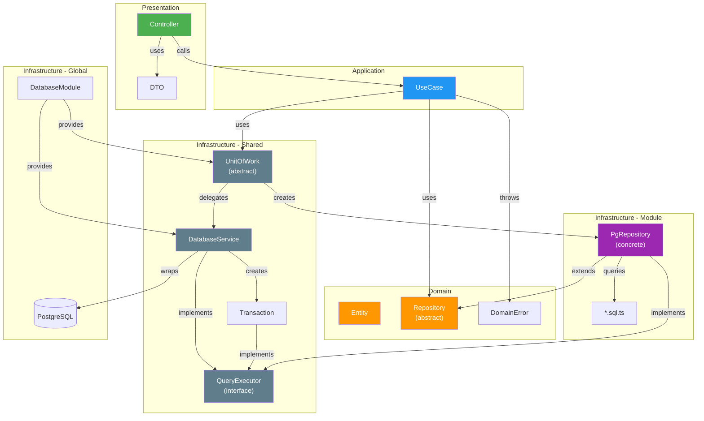

# Estrutura do Projeto: mybitcoin-api

## Objetivo

Definir uma estrutura de projeto que combine:

* **Clean Architecture**
* **DDD (Domain-Driven Design)**
* **NestJS**
* **PostgreSQL (pg puro)**

O objetivo é manter cada domínio autocontido, facilitar a evolução do sistema e reduzir o acoplamento entre módulos.

---

# Princípios

A organização do projeto segue quatro princípios fundamentais:

1. **Organização por domínio (Bounded Context)**
2. **Arquitetura Limpa dentro de cada domínio**
3. **Infraestrutura compartilhada apenas para recursos comuns**
4. **Cada módulo é dono da sua persistência**

Isso significa que o projeto **não é organizado por camadas globais** (`domain/`, `application/`, `infrastructure/` na raiz), mas sim por **módulos de negócio**, onde cada módulo possui suas próprias camadas.

---

# Estrutura Geral

```text
src/
│
├── infrastructure/
│   │
│   ├── database/
│   │   ├── database.module.ts
│   │   ├── database.service.ts
│   │   ├── database.token.ts
│   │   ├── transaction.ts
│   │   ├── postgres.unit-of-work.ts
│   │   └── migrations/
│   │
│   ├── bitcoin-rpc/
│   │
│   ├── telemetry/
│   │
│   ├── storage/
│   │
│   ├── cache/
│   │
│   └── config/
│
├── modules/
│
│   ├── account/
│   │
│   ├── wallets/
│   │
│   ├── ledger/
│   │
│   ├── orders/
│   │
│   ├── trades/
│   │
│   ├── matching/
│   │
│   ├── bitcoin/
│   │
│   └── financial/
│
├── shared/
│   ├── domain.error.ts
│   └── unit-of-work.ts
│
└── app.module.ts
```

---

# Estrutura de um módulo

Cada módulo segue exatamente a mesma organização.

Exemplo:

```text
orders/
│
├── domain/
│
├── application/
│
├── infrastructure/
│
├── presentation/
│
└── orders.module.ts
```

Cada módulo é completamente independente dos demais.

---

# Domain

Contém apenas regras de negócio.

Nunca importa NestJS.

Nunca importa PostgreSQL.

Nunca importa bibliotecas externas.

Exemplo:

```text
orders/
└── domain
    ├── entities
    │   └── order.entity.ts
    │
    ├── value-objects
    │   ├── order-id.vo.ts
    │   └── price.vo.ts
    │
    ├── events
    │   └── order-created.event.ts
    │
    ├── errors
    │   └── insufficient-balance.error.ts
    │
    └── repositories
        └── order.repository.ts
```

A pasta `repositories` contém apenas interfaces.

Exemplo:

```typescript
export abstract class OrderRepository {

    abstract create(order: Order): Promise<void>;

    abstract findById(id: string): Promise<Order | null>;

}
```

---

# Application

Contém os casos de uso.

É responsável por orquestrar o domínio.

Não conhece SQL.

Não conhece PostgreSQL.

Não conhece NestJS.

Exemplo:

```text
orders/
└── application
    ├── place-order.usecase.ts
    ├── cancel-order.usecase.ts
    ├── fill-order.usecase.ts
    └── get-order.usecase.ts
```

Fluxo:

```
Controller

↓

UseCase

↓

Repository Interface
```

---

# Infrastructure

Implementa tudo que é detalhe técnico.

Aqui ficam:

* PostgreSQL
* SQL
* Mappers
* Integrações

Exemplo:

```text
orders/
└── infrastructure
    ├── persistence
    │
    │   ├── pg-order.repository.ts
    │
    │   ├── order.mapper.ts
    │
    │   └── order.sql.ts
    │
    └── events
```

---

## Repositories

As implementações pertencem ao módulo.

Exemplo:

```text
orders/
    infrastructure/
        persistence/
            pg-order.repository.ts
```

e **não**

```text
infrastructure/
    database/
        repositories/
```

Motivo:

`PgOrderRepository` implementa regras de persistência do domínio **Orders**, não da infraestrutura global.

---

## SQL

As queries SQL pertencem ao módulo.

Exemplo:

```text
orders/
    infrastructure/
        persistence/
            order.sql.ts
```

e não:

```text
infrastructure/
    database/
        queries/
```

Cada módulo é responsável pelas suas próprias consultas.

Isso facilita:

* manutenção
* versionamento
* otimização
* auditoria

---

# Presentation

Responsável apenas pela comunicação externa.

Exemplo:

```text
orders/
└── presentation
    ├── orders.controller.ts
    ├── orders.dto.ts
    └── orders.module.ts
```

Responsabilidades:

* receber requisições
* validar DTOs
* chamar Use Cases
* retornar respostas

Nenhuma regra de negócio deve existir aqui.

---

# Infrastructure Global

A infraestrutura compartilhada contém apenas recursos reutilizáveis por toda aplicação.

```text
infrastructure/
│
├── database
├── telemetry
├── cache
├── bitcoin-rpc
├── storage
└── config
```

Ela **não conhece nenhum domínio**.

Por exemplo, o módulo `database` sabe apenas:

* abrir conexões
* iniciar transações
* executar queries
* gerenciar Pool
* fornecer UnitOfWork

Ele nunca sabe que existe uma tabela `orders`.

---

# Unit Of Work

Existe apenas uma implementação.

```text
infrastructure/database
    postgres.unit-of-work.ts
```

Ela é utilizada por qualquer módulo que precise executar operações transacionais.

Fluxo:

```
UseCase

↓

UnitOfWork

↓

Repositories

↓

Commit / Rollback
```

---

# DatabaseModule

O `DatabaseModule` é responsável por fornecer:

* DatabaseService
* UnitOfWork
* conexão PostgreSQL
* gerenciamento de transações

Ele não possui:

* repositories
* queries
* mappers

Esses pertencem aos módulos.

---

# Exemplo completo

```text
modules
└── orders
    │
    ├── domain
    │   ├── entities
    │   ├── repositories
    │   ├── value-objects
    │   ├── events
    │   └── errors
    │
    ├── application
    │   ├── place-order.usecase.ts
    │   ├── cancel-order.usecase.ts
    │   └── get-order.usecase.ts
    │
    ├── infrastructure
    │   └── persistence
    │       ├── pg-order.repository.ts
    │       ├── order.mapper.ts
    │       └── order.sql.ts
    │
    ├── presentation
    │   ├── orders.controller.ts
    │   └── orders.dto.ts
    │
    └── orders.module.ts
```

---

# Fluxo de uma requisição

```
HTTP Request

↓

Controller

↓

UseCase

↓

OrderRepository (Interface)

↓

PgOrderRepository

↓

DatabaseService

↓

PostgreSQL
```

Quando houver transação:

```
HTTP Request

↓

Controller

↓

UseCase

↓

UnitOfWork

↓

Repositories

↓

DatabaseService

↓

PostgreSQL

↓

Commit / Rollback
```

---

# Organização da Persistência

A responsabilidade da persistência fica distribuída por domínio.

| Domínio | Repository            | SQL              |
| ------- | --------------------- | ---------------- |
| Orders  | `PgOrderRepository`   | `order.sql.ts`   |
| Wallets | `PgWalletRepository`  | `wallet.sql.ts`  |
| Ledger  | `PgLedgerRepository`  | `ledger.sql.ts`  |
| Bitcoin | `PgBitcoinRepository` | `bitcoin.sql.ts` |

Não existe uma pasta global contendo todas as queries ou todos os repositórios.

---

# Diagrama de Dependências



### Legenda

| Cor | Camada |
|-----|--------|
| Verde | Presentation |
| Azul | Application |
| Laranja | Domain |
| Roxo | Infrastructure (dentro do módulo) |
| Cinza | Infrastructure (compartilhada) |

### Fluxo de uma requisição (com UnitOfWork)

```
HTTP Request
    ↓
Controller (presentation/)
    ↓
UseCase (application/)
    ↓
UnitOfWork (infrastructure/shared/)
    ↓
PgRepository (infrastructure/persistence/) ← dentro do módulo
    ↓
QueryExecutor (interface)
    ↓
Transaction (dentro de runInTransaction)
    ↓
PostgreSQL
    ↓
Commit / Rollback
```

---

# Benefícios dessa organização

* Cada módulo é autocontido.
* A navegação pelo código fica mais simples.
* O domínio não depende da infraestrutura.
* O SQL permanece próximo do código que o utiliza.
* A infraestrutura compartilhada permanece genérica.
* A troca de tecnologia de persistência impacta apenas o módulo correspondente.
* A arquitetura escala naturalmente conforme novos domínios são adicionados (Matching, OTC, Settlement, Futures, etc.).

Essa organização é especialmente adequada para sistemas financeiros e exchanges, onde cada contexto de negócio evolui de forma relativamente independente e possui regras de persistência próprias.
