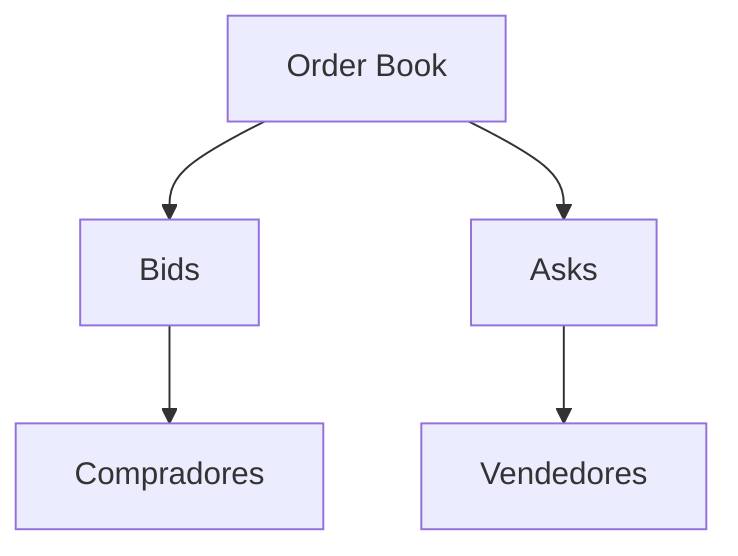
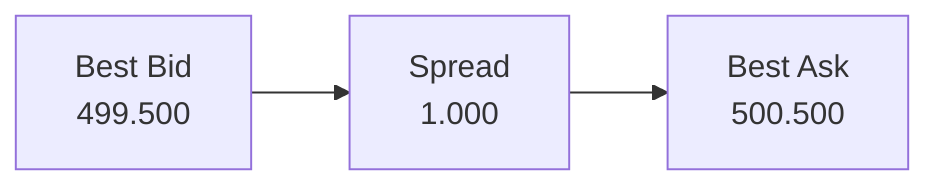
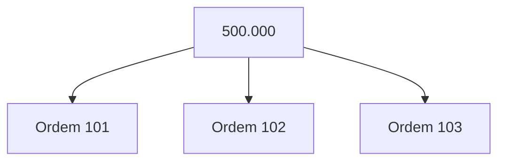
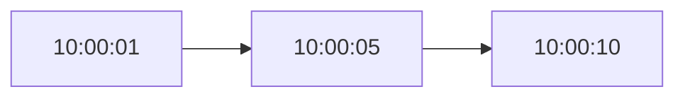
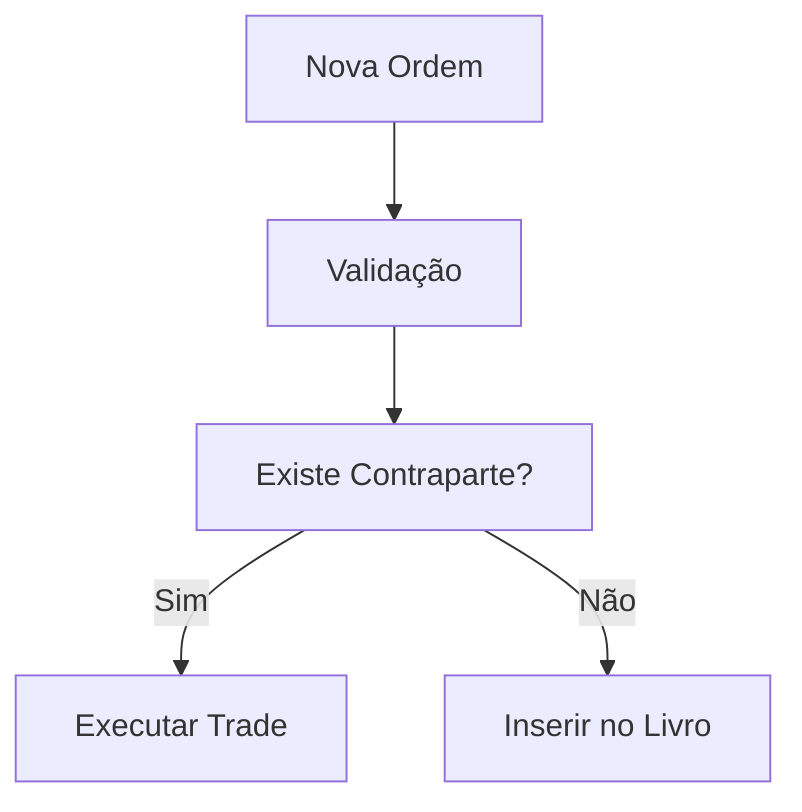
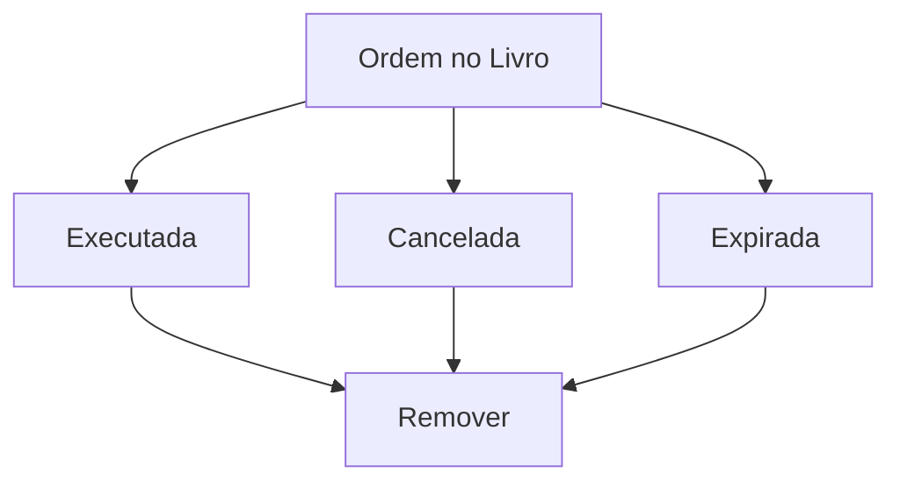

# Order Book

## Visão Geral

O **Order Book** (Livro de Ofertas) é a estrutura central de uma Exchange Spot responsável por armazenar todas as ordens abertas de compra e venda para um determinado par de negociação.

O livro representa a liquidez disponível do mercado em um dado momento e serve como fonte de dados para o Matching Engine executar negociações.

Cada par de negociação possui um Order Book independente.

### Exemplos

* BTC/BRL
* ETH/BRL
* BTC/USDT
* SOL/USDT

---

# Estrutura do Livro

O livro é dividido em dois lados:

| Lado | Descrição        |
| ---- | ---------------- |
| Bids | Ordens de compra |
| Asks | Ordens de venda  |



---

# Bids

## Definição

Bids representam as intenções de compra existentes no mercado.

Cada Bid informa:

* Preço máximo que o comprador aceita pagar.
* Quantidade desejada.

### Exemplo

| Preço (BRL) | Quantidade BTC |
| ----------- | -------------- |
| 499.500     | 0.40           |
| 499.000     | 1.20           |
| 498.500     | 0.80           |

### Ordenação

As ordens de compra são organizadas do maior preço para o menor preço.

```text
499.500
499.000
498.500
```

O melhor preço de compra é chamado de:

```text
Best Bid
```

No exemplo:

```text
Best Bid = 499.500
```

---

# Asks

## Definição

Asks representam as intenções de venda existentes no mercado.

Cada Ask informa:

* Preço mínimo aceito pelo vendedor.
* Quantidade ofertada.

### Exemplo

| Preço (BRL) | Quantidade BTC |
| ----------- | -------------- |
| 500.500     | 0.30           |
| 501.000     | 0.75           |
| 502.000     | 1.10           |

### Ordenação

As ordens de venda são organizadas do menor preço para o maior preço.

```text
500.500
501.000
502.000
```

O melhor preço de venda é chamado de:

```text
Best Ask
```

No exemplo:

```text
Best Ask = 500.500
```

---

# Spread

O Spread representa a distância entre:

* Melhor Bid
* Melhor Ask

### Exemplo

| Tipo     | Valor   |
| -------- | ------- |
| Best Bid | 499.500 |
| Best Ask | 500.500 |

```text
Spread = 1.000 BRL
```

### Representação



---

# Price Levels

## Definição

Um Price Level representa a agregação de todas as ordens que possuem exatamente o mesmo preço.

Ao invés de exibir cada ordem individualmente, a Exchange normalmente apresenta os volumes agrupados por nível de preço.

---

## Exemplo de Ordens

| Ordem | Preço   | Quantidade |
| ----- | ------- | ---------- |
| O1    | 500.000 | 0.20       |
| O2    | 500.000 | 0.30       |
| O3    | 500.000 | 0.10       |
| O4    | 499.500 | 0.50       |

---

## Price Levels Agregados

| Preço   | Volume Total |
| ------- | ------------ |
| 500.000 | 0.60         |
| 499.500 | 0.50         |

### Cálculo

```text
500.000

0.20
+ 0.30
+ 0.10
-------
0.60 BTC
```

---

# Estrutura Interna dos Price Levels

Conceitualmente, cada nível de preço mantém uma fila de ordens.



Todas as ordens do mesmo nível de preço permanecem organizadas pela ordem de chegada.

---

# Price-Time Priority

## Definição

O Matching Engine utiliza a regra de prioridade denominada:

```text
Price-Time Priority
```

Também conhecida como:

```text
FIFO por Preço
```

A prioridade é determinada por dois critérios:

1. Melhor preço.
2. Maior antiguidade.

---

## Prioridade por Preço

Para compras:

```text
Maior preço possui prioridade.
```

Exemplo:

| Ordem | Preço   |
| ----- | ------- |
| A     | 500.000 |
| B     | 499.500 |

Resultado:

```text
A executa antes de B
```

---

Para vendas:

```text
Menor preço possui prioridade.
```

Exemplo:

| Ordem | Preço   |
| ----- | ------- |
| A     | 500.500 |
| B     | 501.000 |

Resultado:

```text
A executa antes de B
```

---

## Prioridade por Tempo

Quando duas ordens possuem o mesmo preço, vence a mais antiga.

### Exemplo

| Ordem | Preço   | Timestamp |
| ----- | ------- | --------- |
| O1    | 500.000 | 10:00:01  |
| O2    | 500.000 | 10:00:05  |
| O3    | 500.000 | 10:00:10  |

Ordem de execução:

```text
O1
↓
O2
↓
O3
```

---

## Fila FIFO



---

# Comportamento do Livro de Ofertas

## Inclusão de Ordem

Quando uma nova ordem chega:

1. É validada.
2. Verifica possibilidade de execução imediata.
3. Caso não execute, é inserida no livro.



---

## Execução Parcial

Uma ordem pode ser executada parcialmente.

### Exemplo

Ordem de compra:

```text
1,0 BTC @ Mercado
```

Livro:

| Preço   | Volume |
| ------- | ------ |
| 500.000 | 0.30   |
| 500.100 | 0.40   |
| 500.200 | 0.30   |

Resultado:

```text
0.30 BTC @ 500.000
0.40 BTC @ 500.100
0.30 BTC @ 500.200
```

A ordem consumiu múltiplos níveis de preço.

---

## Remoção de Ordem

Uma ordem é removida do livro quando:

* É totalmente executada.
* É cancelada pelo usuário.
* Expira (quando aplicável).



---

# Estado Simplificado do Order Book

```text
                BTC/BRL

        ASKS (VENDA)

500.500 | 0.30
500.400 | 0.50
500.300 | 0.20
----------------------
          SPREAD
----------------------
500.200 | 0.40
500.100 | 0.60
500.000 | 1.20

        BIDS (COMPRA)
```

O Matching Engine sempre busca executar ordens contra os melhores níveis disponíveis, respeitando rigorosamente as regras de Price-Time Priority.
